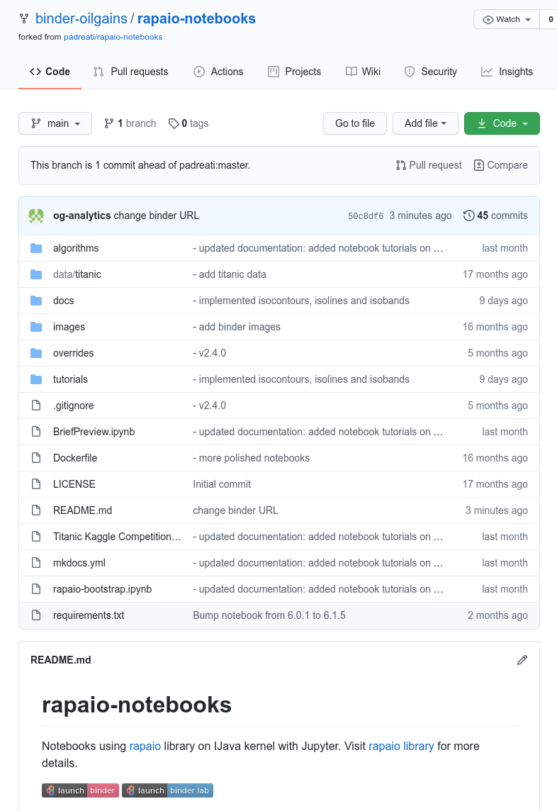
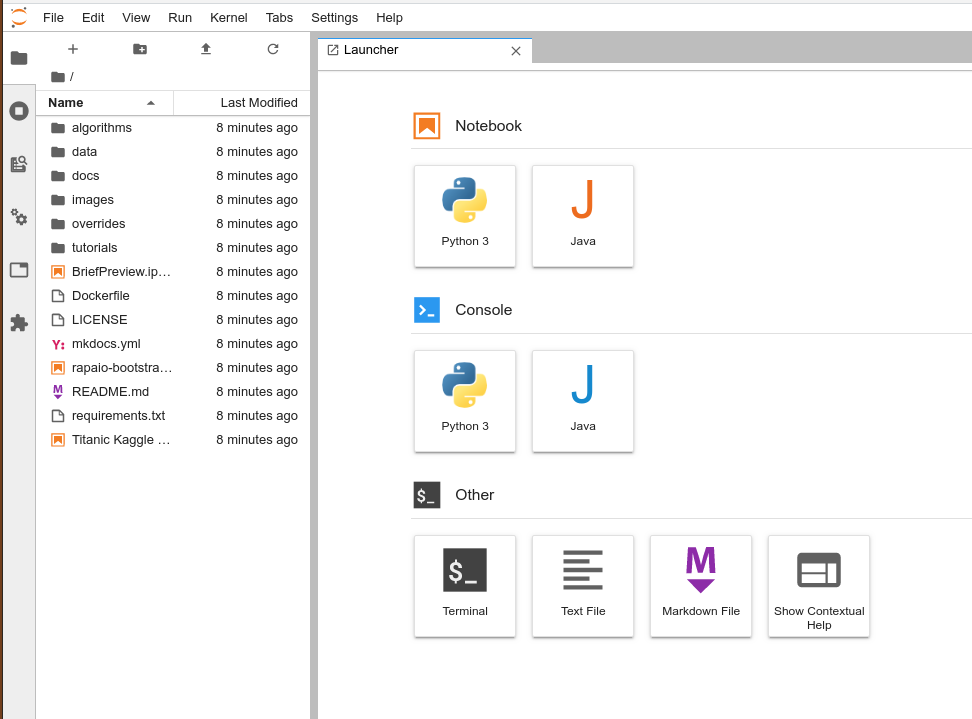

# BUILD

[toc]








## Dockerfile


```ruby
FROM openjdk:11.0.3-jdk

RUN apt-get update
RUN apt-get install -y python3-pip

# add requirements.txt, written this way to gracefully ignore a missing file
COPY . .
RUN ([ -f requirements.txt ] \
    && pip3 install --no-cache-dir -r requirements.txt) \
        || pip3 install --no-cache-dir jupyter jupyterlab

USER root

# Download the kernel release
RUN curl -L https://github.com/SpencerPark/IJava/releases/download/v1.3.0/ijava-1.3.0.zip > ijava-kernel.zip

# Unpack and install the kernel
RUN unzip ijava-kernel.zip -d ijava-kernel \
  && cd ijava-kernel \
  && python3 install.py --sys-prefix

# Set up the user environment

ENV NB_USER jovyan
ENV NB_UID 1000
ENV HOME /home/$NB_USER

RUN adduser --disabled-password \
    --gecos "Default user" \
    --uid $NB_UID \
    $NB_USER

COPY . $HOME
RUN chown -R $NB_UID $HOME

USER $NB_USER

# Launch the notebook server
WORKDIR $HOME
CMD ["jupyter", "notebook", "--ip", "0.0.0.0"]
```